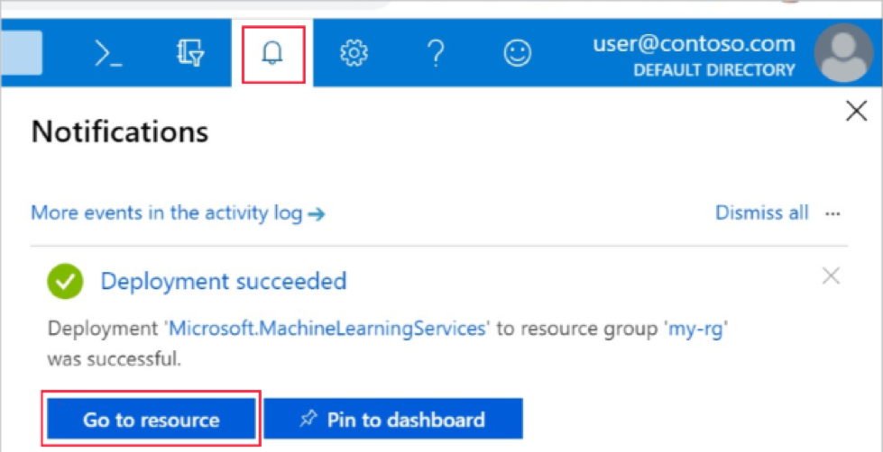
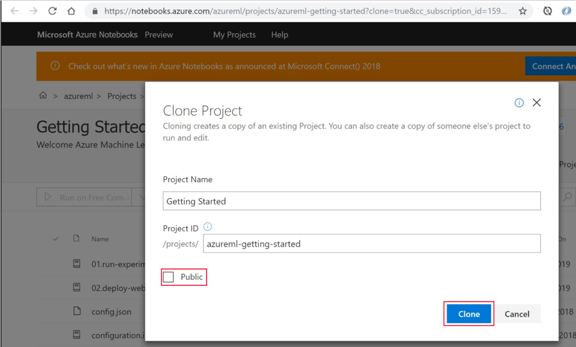
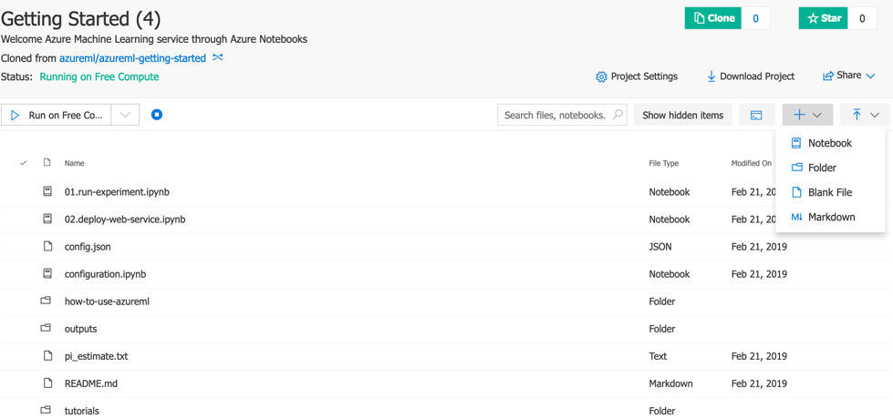

# Tensorflow on Azure ML Service

**LAB Overview**

In this lab you will learn how to train a ML model that will recognize hand-written digits. To achieve it you are going to use Tensorflow as a training framework and Azure ML 
Service as a training environment.

## Task 1: Create Azure Machine Learning Service Workspace
In this section you will learn how to create a Azure Machine Learning Service Workspace from Azure Portal.

1.	Sign in the Azure portal at
https://portal.azure.com
2.	In the upper-left corner of the portal, select **Create a resource**.
3.	In the search bar, enter **Machine Learning**. Select the **Machine Learning service workspace** search result.
4.	In the **ML service workspace pane**, scroll to the bottom and select **Create** to begin.
5.	In the **ML service workspace pane**, configure your workspace:
* **Workspace name:** use a name you want
* **Subscription:** your subscription
* **Resource Group:** use your own or create new
* **Location:** west Europe
6.	When you finish click **Create**. It can take a few moments to create the workspace
7.	Check the notification bell for on a toolbar for deployment status
8.	When the deployment is finished, click “Go to resource”


## Task 2: Create Azure Notebook
In this section you are going to create Azure Notebook, which provides a free cloud platform for Jupyter notebooks that is preconfigured with everything you need to run Machine Learning. From your workspace you can launch this platform to get started using your Azure Machine Learning service workspace.

Azure Notebooks is a separate Azure service.

1.	On the workspace page, select **Explore your Azure Machine Learning service Workspace**.
2.	Select **Open Azure Notebooks**
3.	Sign into Azure Notebooks. Make sure you sign in with the same account you used to sign into the Azure portal
4.	After you sign in, a new tab opens and a Clone Library prompt appears. Cloning this library will load a set of notebooks and other files into your Azure Notebooks account. These files help you explore the capabilities of Azure Machine Learning.
5.	Uncheck **Public** so that you don't share your workspace information with others.
6.	Select **Clone**.

7.	If you see that the project status is stopped, click on **Run on Free Compute** to use the free notebook server.
8.	Select the **+** sign and click **Notebook**

9.	Enter desired name and select **Python 3.6** as a language
10.	Click **New**
11.	Open the notebook by clicking on it. Note that file extension is **.ipynb** which stands for “Interactive Python Notebook”

## Task 3: Explore hand-written digits dataset
In this section you are going to explore the data set that you will be working on. You will see how dataset is structured and how sample data looks like. 
The data set is called MNIST and it contains handwritten digits to recognize.

1.	First, you need to import necessary libraries. In first cell in Jupyter notebook enter following code and execute it (Press Shift + Enter)
```python
%matplotlib inline
import os
import numpy as np
import matplotlib.pyplot as plt

import tensorflow as tf
# Import MNIST data
from tensorflow.examples.tutorials.mnist import input_data

import azureml.core
from azureml.core import Workspace, Experiment, Run

# check core SDK version number
print("Azure ML SDK Version: ", azureml.core.VERSION)
```
2.	Create another cell, import the dataset and display sample digit
```python
mnist = input_data.read_data_sets("/tmp/data/", one_hot=True)
image_index = 0 # take first test image
img = mnist.test.images[image_index]

# draw image
plt.imshow(img.reshape(28, 28), cmap=plt.cm.binary)
plt.show()
```

## Task 4: Run experiment in Azure Machine Learning Service

In this section you will train your model using Tensorflow. You are going to train logistic regression for multi-class classification.

1.	Firstly, you need to connect to Azure Machine Learning Workspace. Note, that you will have to log in during execution of this code. Create new cell and enter:
```python
# load workspace configuration from the config.json file in the current folder.
ws = Workspace.from_config()
print(ws.name, ws.location, ws.resource_group, ws.location, sep = '\t')
```
2.	Then create new experiment:
```python
experiment_name = 'tensorflow-mnist'
experiment = Experiment(workspace=ws, name=experiment_name)
```
3.	And finally it is time to train the model. The model here is simple logistic regression. We are using Tensorflow to minimize cross-entropy error. This code does a few things:
    1.	It start Azure Machine Learning experiment
    2.	It trains a model with given number of epochs (25). The more epochs the training last longer but gives better result
    3. It counts final accuracy of the model
    4. It saves tensorflow model and upload it’s files as the experiment outputs
4.	In new cell enter following code:
```python
run = experiment.start_logging()

# Parameters
learning_rate = 0.01
training_epochs = 25
batch_size = 100
display_step = 1

# tf Graph Input
x = tf.placeholder(tf.float32, [None, 784]) # mnist data image of shape 28*28=784
y = tf.placeholder(tf.float32, [None, 10]) # 0-9 digits recognition => 10 classes

# Set model weights
W = tf.Variable(tf.zeros([784, 10]), name="W")
b = tf.Variable(tf.zeros([10]), name="b")

# Construct model
pred = tf.nn.softmax(tf.matmul(x, W) + b) # Softmax

# Minimize error using cross entropy
cost = tf.reduce_mean(-tf.reduce_sum(y*tf.log(pred), reduction_indices=1))
# Gradient Descent
optimizer = tf.train.GradientDescentOptimizer(learning_rate).minimize(cost)

# Initialize the variables (i.e. assign their default value)
init = tf.global_variables_initializer()

# prepare dir for output model
os.makedirs('./outputs/model', exist_ok=True)
saver = tf.train.Saver()

run.log("Total training epochs: ", training_epochs)
# Start training
with tf.Session() as sess:

    # Run the initializer
    sess.run(init)

    # Training cycle
    for epoch in range(training_epochs):
        avg_cost = 0.
        total_batch = int(mnist.train.num_examples/batch_size)
        # Loop over all batches
        for i in range(total_batch):
            batch_xs, batch_ys = mnist.train.next_batch(batch_size)
            # Run optimization op (backprop) and cost op (to get loss value)
            _, c = sess.run([optimizer, cost], feed_dict={x: batch_xs,
                                                          y: batch_ys})
            # Compute average loss
            avg_cost += c / total_batch
        # Display logs per epoch step
        if (epoch+1) % display_step == 0:
            print("Epoch:", '%04d' % (epoch+1), "cost=", "{:.9f}".format(avg_cost))
            run.log("Cost", avg_cost)

    print("Optimization Finished!")

    # Test model
    correct_prediction = tf.equal(tf.argmax(pred, 1), tf.argmax(y, 1))
    # Calculate accuracy
    accuracy = tf.reduce_mean(tf.cast(correct_prediction, tf.float32))
    print("Accuracy:", accuracy.eval({x: mnist.test.images, y: mnist.test.labels}))
    
    saver.save(sess, './outputs/model/mnist-tf.model')
    for f in os.listdir('./outputs/model'):
        if f.startswith("mnist") or f.startswith("checkpoint"):
            run.upload_file(name = 'outputs/model/' + f, path_or_stream = 'outputs/model/' + f)
run.complete()
```
5.	After the code finish, type “run” in new cell and open Azure Machine Learning Service link. You will see how cost function value decreases as number of epochs increase
```python
run
```

## Task 5: Deploy your model as a service in an Azure Container Instance.
In this section you are going to deploy your model as a service. You are going to create Docker image and deploy it using Azure Container Instance Service.

1.	Register your model in Azure Machine Learning Service:

```python
model = run.register_model(model_name='tf-dnn-mnist', model_path='outputs/model')
```

2.	Create score.py file using the code below. (Note "%%writefile score.py" directive, that will write this cell content to the file instead of executing it). 

This file contains two functions:
* Init – this function is executed one when the container starts
* Run  - this function is executed each time a request to the service is made
  
Insert this code in new cell:
```python
%%writefile score.py
import tensorflow as tf
import numpy as np
import os
import json
from azureml.core.model import Model

def init():
    global w_out, b_out, sess
    tf.reset_default_graph()
    model_root = Model.get_model_path('tf-dnn-mnist')
    graph = tf.train.import_meta_graph(os.path.join(model_root,'mnist-tf.model.meta'))
    
    sess = tf.Session()
    graph.restore(sess, os.path.join(model_root, 'mnist-tf.model'))
    w_out, b_out = sess.run(["W:0", "b:0"])

def run(raw_data):
    img = np.array(json.loads(raw_data)['data'])
    x_out = tf.placeholder(tf.float32, [None, 784]) 
    predictor = tf.nn.softmax(tf.matmul(x_out, w_out) + b_out)   

    classification = sess.run(tf.argmax(predictor, 1), feed_dict={x_out: [img]})
    return str(classification[0])
```

3. Create another cell. We now need to create Python environment file:
```python
from azureml.core.runconfig import CondaDependencies

cd = CondaDependencies.create()
cd.add_conda_package('numpy')
cd.add_tensorflow_conda_package()
cd.save_to_file(base_directory='./', conda_file_path='myenv.yml')

print(cd.serialize_to_string())
```

4. Create webservice configuration:
```python
from azureml.core.webservice import AciWebservice

aciconfig = AciWebservice.deploy_configuration(cpu_cores=1, 
                                               memory_gb=1, 
                                               tags={'name':'mnist', 'framework': 'TensorFlow'},
                                               description='Tensorflow on MNIST')
```

5.	Create image configuration:
```python
from azureml.core.image import ContainerImage

imgconfig = ContainerImage.image_configuration(execution_script="score.py", 
                                               runtime="python", 
                                               conda_file="myenv.yml")
```

6.	Run the webservice (this code will take samo time to fninish):
```python
%%time
from azureml.core.webservice import Webservice

service = Webservice.deploy_from_model(workspace=ws,
                                       name='tf-mnist-svc',
                                       deployment_config=aciconfig,
                                       models=[model],
                                       image_config=imgconfig)

service.wait_for_deployment(show_output=True)
```

## Task 6: Test your web service!
In this section you are going to test your webservice. You are going to use the example that you displayed at the beginning. (This code assumes that img variable existst)

1. Test your service via Python API
```python
import json

test_samples = json.dumps({"data": img.tolist()})
test_samples = bytes(test_samples, encoding='utf8')

result = service.run(input_data=test_samples)
print("label: " + str(mnist.test.labels[image_index].argmax()))
print("prediction: " + result)
```

2. Your service expose URL. You can get it by calling:
```python
print(service.scoring_uri)
```
So you can use any REST API cient to send a HTTP request and call your service. We are going to do so using Python's requests library:
```python
import requests
input_data = "{\"data\": " + str(list(img)) + "}"
headers = {'Content-Type':'application/json'}

resp = requests.post(service.scoring_uri, input_data, headers=headers)

print("POST to url", service.scoring_uri)
print("label:", str(mnist.test.labels[image_index].argmax()))
print("prediction:", resp.text)
```